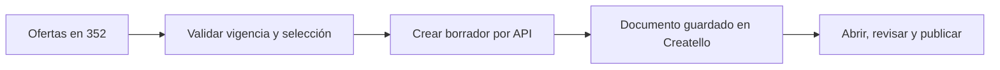

**Propuesta para eliminar el copiar y pegar entre 352 Flights y Creatello — 8 de septiembre de 2026.**

Mi recomendación es empezar con un botón «Crear borrador en Creatello» dentro de 352 Flights. Eliges ofertas e idioma, revisas el resumen y pulsas una vez. Creatello recibe los datos, guarda un documento editable y devuelve un enlace para abrirlo con la plantilla y las fotos asignadas. Después se puede automatizar también la selección y el renderizado. El JSON continúa existiendo como formato interno; deja de ser una tarea del usuario.

He identificado en `/Users/albertorodriguez/Desktop/Slideshows/createllomax-main` las plantillas y el contrato que utiliza este generador. Se toma ese proyecto local como destino probable de la integración. No se ha confirmado su URL ni comparado con su versión desplegada. Los endpoints, tablas y estados descritos a continuación son propuestas, no funcionalidades ya instaladas.

**La base que ya tienes permite aprovechar bastante trabajo.**

| Responsabilidad | Implementación actual observada |
|---|---|
| Encontrar precios | Scanner Python y `price_snapshots` en 352 |
| Proponer ofertas | `buildTikTokOfferProposal()` y `/api/ops/tiktok-json` |
| Preparar contenido | `generateCreatelloDocument()`; tres plantillas y cinco idiomas |
| Revisar selección | Interfaz de propuestas, selección, vista previa y copia |
| Importar contenido | `JSON.parse()` y normalización dentro de cada plantilla de Creatello |
| Asignar fotos | Biblioteca de referencias, coincidencia de ciudades y reparto automático |
| Dibujar imágenes | Canvas en el navegador; `render352Blob()` en la plantilla 352 |
| Guardar imágenes | Storage y registros `generated_images` con estado `draft` |
| Gestionar publicación | `PublishDialog`, funciones de publicación y calendario existentes |

La plantilla 352 mantiene su documento editable en estado React y prepara imágenes cuando se pulsa publicar. No he encontrado en ese recorrido una API de entrada ni persistencia del documento completo que permita cargarlo por ID. Crear solo una fila en `generated_images` no reemplaza ese documento: esa tabla guarda imágenes ya renderizadas. [Importación y preparación actuales](</Users/albertorodriguez/Desktop/Slideshows/createllomax-main/src/components/FlightDeals352Template.tsx:514>).

**Primera entrega: transferencia de un borrador con un clic.**



La pantalla de 352 mostraría «Selecciona ofertas → Revisa → Crear borrador». Al terminar: «Borrador creado · Abrir en Creatello». Si la otra web tarda o falla, debe mostrar «Pendiente de envío» o «Reintentar», sin perder la selección. Deshabilitar el botón mientras se envía ayuda a la UX, pero la protección contra duplicados debe estar también en servidor.

En 352, añadiría un endpoint protegido, por ejemplo `POST /api/ops/content-jobs`. Recibe IDs de ofertas, plantilla e idioma. El servidor vuelve a cargar los datos canónicos y comprueba vigencia, fechas, moneda, escalas y campos obligatorios. No debe aceptar como autoridad el precio enviado desde el navegador. Guarda un trabajo y el contenido que se va a transferir antes de llamar a Creatello.

En Creatello, añadiría `POST /api/integrations/352flights/drafts` en su backend de Vercel, o una Edge Function equivalente. Elegir una sola entrada. Valida la integración, resuelve el propietario y workspace permitido, valida el contrato y crea un documento en una tabla nueva como `content_documents`. Devuelve un `draftId` y una ruta del editor, por ejemplo `/templates/flight-deals-352?draft=<id>`. El editor carga ese ID mediante su sesión normal y comprueba pertenencia al workspace. Saber el ID no otorga acceso.

La tabla debería conservar documento original, versión del contrato, plantilla, idioma, datos de origen, revisión, propietario, workspace, estado y fechas. Guardar por separado la composición editable —fotos, recortes y textos modificados— permite actualizar precios sin borrar decisiones manuales. Ofrecer guardado automático del documento también evita perder trabajo al recargar la pestaña.

**El contrato debe contener datos de vuelo recuperables.** El JSON actual está orientado al diseño: formatea fechas como «8 nov», convierte EUR a «€» y omite IDs de observación, año completo, comprobación y caducidad. Es apropiado para pintar una tarjeta, pero insuficiente para sincronizarla y actualizarla.

Usaría un envoltorio versionado con los datos reales y dejaría que un adaptador produzca el JSON visual que ya admite cada plantilla. Este es un ejemplo sintético, no una oferta encontrada:

```json
{
  "schemaVersion": 1,
  "eventId": "c2efc9f2-0a88-4a89-a265-2b345f304c42",
  "externalId": "352-editorial-2026-09-08-001",
  "revision": 1,
  "source": "352flights",
  "template": "travel-offer",
  "language": "es",
  "createdAt": "2026-09-08T10:00:00Z",
  "offers": [
    {
      "sourceSnapshotId": "example-snapshot-001",
      "itineraryKey": "example-itinerary-001",
      "originAirport": "LUX",
      "destinationAirport": "NCE",
      "destinationCity": "Niza",
      "departureDate": "2026-11-08",
      "returnDate": "2026-11-15",
      "priceMinor": 5800,
      "currency": "EUR",
      "tripType": "round_trip",
      "adults": 1,
      "cabin": "economy",
      "stops": 0,
      "checkedAt": "2026-09-08T09:30:00Z",
      "expiresAt": "2026-09-09T09:30:00Z",
      "sourcePageUrl": "https://www.352flights.com/es/ofertas/nice"
    }
  ]
}
```

`expiresAt` indica cuándo deja de ser aceptable editorialmente esa comprobación; no significa que el proveedor garantice el precio hasta entonces. Definir una clave de itinerario que distinga segmentos, aerolínea/horario, escalas y condiciones cuando esos datos existan. Para `flight-deals-352` exigir también compañía, horarios y duración; la selección debe garantizar que los vuelos son directos si la plantilla los presenta así. La validación tiene que ser por plantilla, no simplemente «JSON válido».

Compartir el esquema Zod y ejemplos de contrato entre ambas aplicaciones evita que cada una interprete distinto un campo. Se puede empezar con un pequeño módulo versionado y pruebas de compatibilidad; no hace falta unificar ambos repositorios. Mantener moneda ISO, fechas ISO, zonas horarias y valores numéricos en el contrato, y localizar solo al renderizar. Conservar el JSON visual actual en un campo separado si facilita la transición.

**Seguridad y reintentos desde el primer día.** La llamada debe ser servidor a servidor sobre HTTPS. Propondría una credencial exclusiva de esta integración y una firma HMAC sobre cuerpo original, timestamp y event ID. El receptor verifica firma, ventana temporal y repetición antes de escribir. Nunca enviar claves de servicio de Supabase al frontend ni compartir la clave administrativa de toda la base entre webs. La autorización debe limitar la integración a crear/consultar sus borradores dentro del workspace asignado por el receptor.

En una Edge Function con autenticación personalizada, configurar de forma compatible la validación de plataforma y verificar explícitamente la firma dentro de la función. Desactivar la validación JWT sin añadir otra autenticación no protege la API. [Documentación de autenticación de Supabase](https://supabase.com/docs/guides/functions/auth).

Añadir una restricción única por integración, `externalId` y revisión. La primera entrega crea el documento; la misma entrega repetida devuelve el mismo ID. La misma clave con contenido distinto devuelve conflicto. Crear el documento y registrar la recepción dentro de una transacción. No basar la deduplicación solo en desactivar el botón o en una consulta previa vulnerable a dos llamadas simultáneas.

El trabajo guardado en 352 actúa como bandeja persistente de envíos pendientes. Un proceso programado recoge pendientes y reintenta errores temporales con espera progresiva, límite de intentos y registro del motivo. Firma cada intento con un timestamp nuevo y mantiene el mismo identificador lógico. Ante un timeout no sabe si el receptor guardó: reenvía de forma idempotente. Un error de validación requiere corregir datos, no reintentar indefinidamente. Cancelar trabajos caducados.

La respuesta propuesta es `{ draftId, status, editorPath, revision }`. Guardarla en 352 permite tener historial y acceso directo. Para actualizar estado, empezar con consulta periódica solo mientras la pantalla está abierta y reconciliación del proceso de trabajos. Un webhook firmado de vuelta puede añadirse después si aporta valor. CORS no reemplaza autenticación; una llamada servidor a servidor no necesita abrir la API al navegador de otra web.

**Segunda entrega: propuestas editoriales automáticas.** Guardar «recetas» como configuración, no como prompts que debas escribir cada vez. Ejemplos:

| Receta | Regla de selección | Resultado |
|---|---|---|
| Escapadas del próximo mes | 2–4 noches, sin escalas, presupuesto elegido | Borrador de 5–7 destinos |
| Vacaciones escolares | Fechas del calendario de Luxemburgo | Ofertas que encajan con familias |
| Bajadas recientes | Último precio frente a observaciones comparables suficientes | Carrusel con ahorro explicable |
| Semana de playa | Estancia definida y destinos de playa | Selección temática con fechas concretas |

Ejecutar la receta tras completar la sincronización del scanner, no al final de cada tarifa encontrada. Si un evento genera varios trabajos, aplicar cuotas y deduplicación. También puede ejecutarse a una hora configurable en Luxemburgo y omitir el borrador cuando faltan suficientes ofertas válidas. No rellenar slides con precios antiguos para alcanzar una cantidad.

Definir diversidad de destinos, frecuencia máxima de repetición y volumen semanal por idioma. Guardar una selección editorial común y generar sus variantes, respetando que las condiciones del vuelo sean idénticas. Añadir texto, caption, CTA y enlaces con atribución por receta y documento. El italiano se puede incorporar al contrato porque la web lo utiliza y la exportación actual no.

La IA puede redactar titulares, entradillas, traducciones y alternativas de caption a partir de hechos ya validados. Precio, fechas, escalas, equipaje y descuentos deben proceder de datos y reglas deterministas. Cuando falten datos, bloquear o omitir esa afirmación. Evitar presentar una imagen generada como evidencia de un hotel o lugar concreto; la biblioteca de fotos que ya existe ofrece un punto de partida más controlable.

**Tercera entrega: imágenes listas sin abrir Creatello.** La API de borradores no basta para esto: el renderizador actual usa `document.createElement('canvas')`, fuentes y recursos del navegador. Necesita una ejecución independiente para operar con la pestaña cerrada.

Empezaría extrayendo una página de renderizado privada que cargue un documento/revisión concretos y use las plantillas actuales. Un worker con navegador headless espera fuentes e imágenes, renderiza, guarda los archivos y comprueba que no faltan recursos. Puede vivir en un servicio de trabajos con recursos adecuados, incluido el VPS si tiene capacidad disponible, sin competir de forma descontrolada con el scanner. Otra opción posterior es un renderizador específico de servidor; reduce dependencia del navegador pero obliga a comprobar paridad visual.

Guardar cada trabajo, artefacto, tamaño, orden y error. Usar IDs y rutas deterministas para que un reintento no multiplique archivos. Mantener estado «en preparación» hasta completar todas las imágenes y compensar cargas parciales. Comprobar caracteres largos, idiomas, banderas, fuentes, fotos ausentes y recortes. Los formatos actuales del editor y los del backend de publicación deben converger; no asumir que cambiar una dimensión conserva el diseño.

El estado visible podría ser «Borrador → Preparando imágenes → Listo para revisar → Programado → Publicado», con «Error» y «Caducado» en pasos aplicables. No llamar «Publicado» a una importación o a un trabajo aceptado: hace falta confirmar el resultado del canal.

**Cuarta entrega: programación con control de vigencia.** Reutilizar las funciones y calendario existentes después de comprobar permisos, conexiones y restricciones actuales de cada plataforma. Al principio, automatizar hasta «Listo para revisar» y dejar que una acción humana apruebe la publicación. Ese control editorial no es un requisito para borrar el copiar/pegar; es una forma de validar calidad mientras se estabiliza el proceso.

Antes del horario de publicación, volver a comprobar que los precios cumplen la política. Si cambia un precio, renovar datos y renderizar de nuevo; si cambia una selección aprobada de forma material, pedir nueva revisión dentro del producto. Si faltan ofertas o falla la comprobación, pausar y mostrar la incidencia. Un carrusel publicado no debe considerarse modificable como un documento interno: conservar enlace de origen y ofrecer información actual en la web de destino.

**Opciones de integración y elección.**

| Opción | Cuándo encaja | Evaluación para tu caso |
|---|---|---|
| API directa 352 → Creatello | Ambas aplicaciones tienen backend y controlas su código | Recomendada: reutiliza lo existente y devuelve el borrador |
| Creatello consulta una API de 352 | Quieres elegir y crear siempre dentro de Creatello | Buena alternativa; conserva autenticación y calidad centralizadas |
| Herramienta de orquestación entre APIs | Quieres añadir más destinos y reglas visuales | Útil después; no sustituye validación, persistencia o renderizado |
| Base de datos compartida | Mismo producto y modelo de permisos deliberado | No necesaria ahora: acopla esquemas y amplía acceso |
| Automatizar clics y portapapeles | No puedes modificar la web receptora | Puente temporal más frágil ante cambios de interfaz |

**Esfuerzo orientativo, condicionado al código y despliegue de Creatello.** La API de borradores, persistencia del documento, carga por ID y primer control de reintentos puede ser una entrega de 3–5 días de una persona familiarizada con ambas apps, después de corregir la selección de precios. Recetas y cola operativa: aproximadamente 2–4 días adicionales. Renderizado desatendido y programación robusta: 5–10 días adicionales, con más incertidumbre por recursos, imágenes y APIs externas. Son rangos de planificación, no un presupuesto ni una promesa de plazo.

**Criterios para dar por terminada la primera entrega.** Debe crearse un borrador editable en el workspace correcto, abrirse por enlace después del login y sobrevivir a una recarga. Dos clics o un timeout deben devolver el mismo documento. Una oferta vieja, un precio modificado o un idioma/plantilla inválidos deben generar un error comprensible. Una firma inválida u otro workspace deben denegarse. Un fallo temporal debe poder reintentarse sin perder selección. Copiar JSON puede quedar como exportación secundaria.

La mejora de producto más útil sería, por tanto: «Prepárame las mejores ofertas del próximo mes» y recibir borradores listos para revisar. La selección compartida, la fecha de comprobación y el historial de envíos permiten ampliar esa idea a newsletter, carruseles y páginas de destino sin repetir trabajo ni perder el origen del dato.
